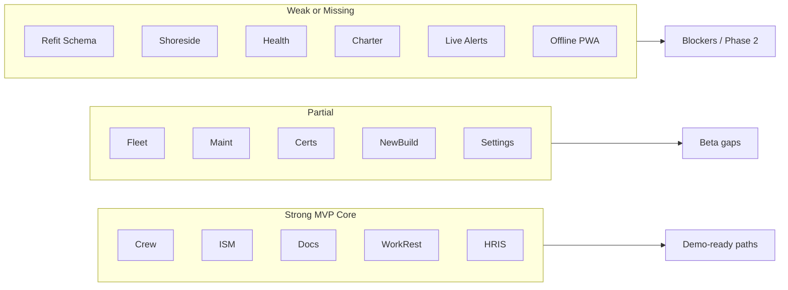

# STORM Full Status Audit (Sep 2026)

**Date:** 19 Sep 2026  
**Scope:** codebase + Notion architecture + GitHub  
**Note:** Granola meetings were not accessible via MCP for this audit.  
**Notion:** A full child page under [Maritime Master — STORM V2.0](https://app.notion.com/p/310eb97cfbdc81c9af86e043579e0287) could not be created — the workspace is at Notion’s free block limit. A summary comment was posted on that hub page instead; upgrade or free blocks to host the full audit there.

---

## Verdict

STORM (Superyacht Technical Operations, Research & Management) is a **broad captain-built MVP** on Vite/React/Supabase (`digbyberriman-collab/maritime-master`), aimed at Inkfish’s seven-vessel fleet and a Gabe Newell / Oceanco demo path.

- **Core ops** (crew, ISM/incidents/drills, documents, work-rest, HRIS) are substantially real.
- **Nav surface area far exceeds finished product** (~265 Coming Soon leaves).
- **Largest open product gap:** Refit `rf_*` DB.
- **Largest open ownership gap:** Digby→Gabe migration Stages 1–7.
- Notion architecture (Feb 2026) and Work List are **stale relative to Sep 2026 code**.

---

## What STORM is (today)

| Layer | Reality |
|-------|---------|
| Product | Fleet ops SaaS: ISM, crew, certificates, maintenance, HRIS, yard/refit UI, logbooks |
| Target | Inkfish fleet (DRAAK, GAME CHANGER, LEVIATHAN, ROCINANTE, XIPHIAS, DAGON, HYDRA); demo narrative for Gabe |
| Stack | Vite 5 + React 18 + TS + Tailwind/shadcn; **Supabase-only** backend (`pfvtrtkqkvjbnbaabgpv`); Lovable hosting |
| Nav (live UI) | 6 modules: Fleet, Vessel, Shoreside, Health & Wellness, Yard, HRIS (see `.lovable/plan/module-navigation-aesthetic-update-2026-09-16.md`) |
| Notion architecture | Still the older **8-module Maritime Master v4.1** model — not fully reconciled with the 6-module nav |

Notion hub: [Maritime Master — STORM V2.0](https://app.notion.com/p/310eb97cfbdc81c9af86e043579e0287)

---

## Module maturity (code evidence)

| Area | Status | Evidence |
|------|--------|----------|
| **HRIS** | Production-ready (go-live checklist remains) | Full routes + phase0–5 migrations; [`docs/HRIS.md`](HRIS.md); PRs #21–#23 merged 17 Sep 2026 |
| **Crew / leave / rotation** | Production-ready | Live modules + DB; Crew List done per [`roadmap.md`](../roadmap.md) |
| **Incidents / drills / work-rest** | Production-ready | Dedicated modules + edge functions + SQL |
| **Documents / ISM forms** | Near production | Real CRUD; some vessel Safety leaves still placeholders |
| **Maintenance / certificates** | Partial | Core pages live; many category/dept leaves Coming Soon |
| **Fleet** | Partial | Dashboard, map, itinerary, vessels; scheduler/reports/tickets Coming Soon |
| **New-build (Yard)** | Partial | 24 routes + `nb_*` migrations |
| **Logbooks** | Prototype | Meridian port + migrations; **no class/MCA/Cayman approval** ([`docs/LOGBOOKS.md`](LOGBOOKS.md)); PR #24 merged |
| **Refit (Yard)** | Prototype / blocked | Full UI calling `rf_*`; **no `rf_*` CREATE in migrations**; only open [`roadmap.md`](../roadmap.md) item |
| **Shoreside / Health** | Coming Soon | Nav only; no `src/modules` packages |
| **Charter & guest / procurement** | Mostly missing vs Notion | Notion Module 4/6 marked Active Build; app mostly placeholders |
| **Alerts center** | Prototype | Sample/hardcoded alerts on `/alerts` |
| **Offline / emergency bar** | Future | Demo + Notion emphasize offline; not shipped as PWA |

Infra snapshot: **109** migrations, **~26** edge functions, **33** `src/modules` packages.

---

## Roadmap vs reality

**Done (recent):** Home `/`, module slider nav, floating actions, top bar/vessel selector, Crew List, HRIS DB ([`roadmap.md`](../roadmap.md)).

**Open product:** Apply outstanding **refit (`rf_*`) database setup**.

**Notion Work List (Feb 2026)** — mostly still *Not started* (charter turnaround, MARPOL, workflows, report defs, etc.); only *In progress*: Data Model schemas, RBAC matrix. **Code has outrun this board** (HoR, leave, HRIS, logbooks, Inkfish backup tooling already shipped). Treat Work List as outdated planning debt, not current truth.

---

## Ownership / migration (Digby → Gabe)

From [`MIGRATION-PLAN.md`](../MIGRATION-PLAN.md):

- **Stage 0 complete** (PAT scrubbed from working tree, `.env` hygiene, baseline build/tests) — PR #14 merged.
- **Stages 1–7 incomplete** — need Gabe GitHub/Supabase/Lovable, schema dump, secrets, cutover.
- **Manual hygiene still open:** revoke leaked PAT (still in git history), rotate Supabase anon key.
- **Deferred:** Vessel Management Department Digby/Gabe-only RLS.
- **Risk:** 25 edge functions `verify_jwt = false` (auth inside functions — needs review before Gabe redeploy).

---

## Security & quality

| Item | State |
|------|--------|
| Feb 2026 bug audit | No critical bugs ([`AUDIT-REPORT.md`](../AUDIT-REPORT.md)); ESLint/`any` debt remains |
| Open PR #20 | Hooks deps + mutation safety (still OPEN since 16 Sep) |
| Open PR #19 | NotebookLM skills (orthogonal) |
| Legacy roots | Unused `pages/` / `routes/` called out historically |
| Types drift | HRIS docs warn `types.ts` was hand-patched — regenerate from live project |

---

## Commercial / demo posture

[`DEMO-SCRIPT.md`](../DEMO-SCRIPT.md) (31 Jan 2026): pitch for Gabe — dashboard, ISM, crew, maintenance, differentiators. Pre/post-demo checklists still unchecked in-repo. Product story: **MVP for beta of ~5–10 vessels**; offline called out as future.

Inkfish: watermark + backup/migration tooling (PR #25 merged); fleet framing lives in Notion architecture page.

---

## Gaps vs Notion architecture (v4.1)

Notion still marks almost all Module Tracker rows **Active Build**. Reality:

- **Aligned / ahead:** Crew, HoR, Safety core, Documents, Admin/RBAC substrate, HRIS (beyond original 8-module sketch).
- **Behind Notion labels:** Charter, Financials/procurement depth, Port & marina, AI Insights (correctly Planned), offline emergency bar, full MOC/MARPOL surfaces.
- **Nav model drift:** Live app = 6 modules; Notion = 8 modules — needs a reconciliation pass.

---

## Priority order (recommended)

1. **Security hygiene** — revoke PAT, rotate anon key (Digby).
2. **Refit `rf_*` schema** — unblock Yard Refit (only open roadmap checkbox).
3. **HRIS go-live checklist** — cron/sweeper, types regen, edge deploy ([`docs/HRIS.md`](HRIS.md)).
4. **Replace sample Alerts / flights seed** with live data where demos claim it.
5. **Reconcile Notion** — update Module Tracker + Work List to match Sep 2026 code; align 6- vs 8-module nav.
6. **Gabe migration Stages 1–7** when accounts exist.
7. **Defer / Phase 2** — Shoreside, Health, Charter depth, offline PWA, class-approved logbooks.

---

## Sources

- Repo: `roadmap.md`, `MIGRATION-PLAN.md`, `docs/HRIS.md`, `docs/LOGBOOKS.md`, `DEMO-SCRIPT.md`, `src/config/sitemap.ts`
- GitHub: merged PRs #14, #22–#25; open #19, #20
- Notion: [Maritime Master — STORM V2.0](https://app.notion.com/p/310eb97cfbdc81c9af86e043579e0287), Work List, Module Tracker
