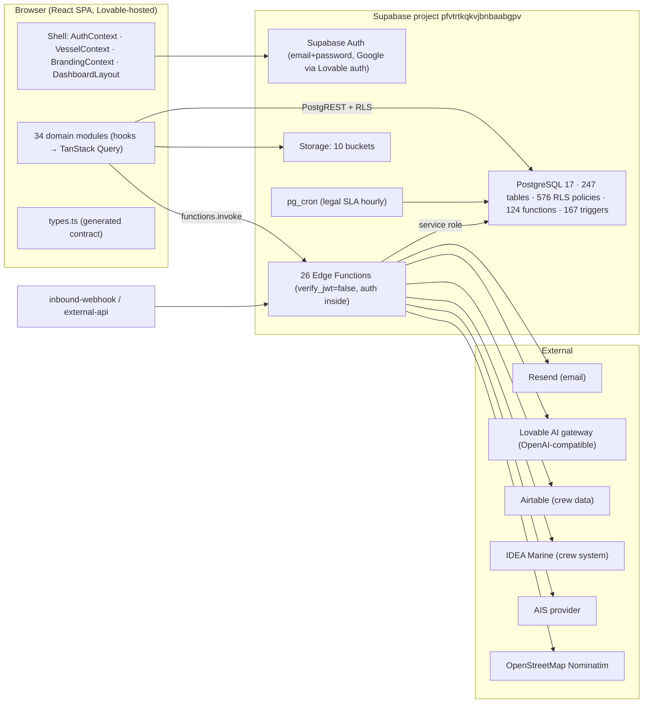

# STORM (Maritime Master) — Full System Audit

**Date:** 19 September 2026
**Repository:** `digbyberriman-collab/maritime-master`, branch `claude/nice-pascal-ar3hbe` at `5ff950f` (`main` at `41b8ca0` plus two commits)
**Live system:** Lovable project "STORM" (`dd2021a3-…`), Supabase project `pfvtrtkqkvjbnbaabgpv` (Lovable Cloud), published to a public audience
**Method:** static review of every module, migration and edge function by one lead and five parallel sub-audits; local lint / typecheck / test / build; read-only SQL against the live database; GitHub Actions and PR history via the API. No feature work, refactoring or architectural change was made as part of the audit. Section 11 lists exactly what was and was not verified.

Evidence tags used throughout: **[V]** verified by reading code or querying the live system, **[I]** inference, **[U]** unknown / not verifiable from this session.

---

## 1. Executive assessment

STORM is a broad, single-tenant-in-practice fleet-operations platform for the Inkfish superyacht and research-vessel fleet, built mostly through Lovable's AI editor on a React + Vite + Supabase stack. It has 34 frontend modules, 247 live database tables, 26 edge functions and 110 migrations. Its navigation advertises 274 sidebar leaves; 48 of them resolve to real pages. [V]

The honest position is: **a large, uneven prototype with several production-grade cores and a long tail of fabricated or disconnected surfaces.** The strong cores are HRIS (17 unit-tested engines, no `any` casts, live schema), incidents / CAPA, risk assessments and permits, audits, documents (library, review, approval), ISM forms, the rotation planner, itinerary, training, the Meridian logbooks prototype, and the new Legal module. [V] The weak areas are not "unfinished features" so much as **features that appear finished but are not connected**: the Refit module (10k lines, 32 routes) has no database schema at all; Hours of Work & Rest, the flagship MLC compliance record, is wired to nine tables that do not exist on the live database; a dozen admin and compliance pages render hard-coded sample data, including real crew names; the AI certificate reader is a timer with a fixed answer. [V]

Three findings are severe enough to block any production or multi-customer use:

1. **Cross-tenant exposure in New Build.** All 43 `nb_*` tables grant full read/write to every authenticated user with `USING (true)`; combined with open self-registration that creates a new company on sign-up, anyone who can register can read and modify every new-build project, budget and purchase order. [V]
2. **A leaked GitHub personal access token** is still present in git history and, worse, is written in plain text inside `MIGRATION-PLAN.md` on `main`. [V] It must be revoked; the document must be scrubbed.
3. **CI has never passed.** Every GitHub Actions run fails at the lint step on two pre-existing errors, so typecheck, tests and build are skipped and `main` has no automated protection. [V] Lovable's bot then merged a stale snapshot into `main` today and silently deleted two just-merged PRs' worth of files (restored on this branch). [V]

The live database holds reference data, an imported roster of 557 profiles (543 without a login) and Airtable-derived rotation data, but essentially no operational records: zero incidents, documents, contracts, alerts or logbook entries, and one user active in the last 30 days. [V] STORM is therefore **pre-production**: real PII is loaded, but nobody is running their operation on it yet. That is the right moment to fix the structural problems above before consolidation with other projects is attempted.

Maturity by area: **Ready for pilot use** — HRIS, crew roster and leave (with two silent gaps), incidents/CAPA, audits, risk assessments, documents core, ISM forms core, rotation planner, itinerary, training, legal. **Prototype** — logbooks (engineered, but not class/flag approved), New Build (schema present, tenant isolation absent, several broken pages), dashboards. **Not functional** — Refit, Work & Rest, flights, alerts page, most of Settings/Admin, compliance tabs, Shoreside and Health & Wellness (navigation only).

---

## 2. Purpose and scope

### 2.1 Intended users and business purpose

STORM ("Superyacht Technical Operations, Research & Management") is a fleet-management SaaS for a management company operating several vessels. Its design centre is the Inkfish fleet of seven vessels (M/Y DRAAK, GAME CHANGER, LEVIATHAN, ROCINANTE, XIPHIAS and R/V DAGON, HYDRA) [V, live `vessels` table], with a documented demo path toward a second owner ("Gabe") and a formal ownership-transfer runbook (`MIGRATION-PLAN.md`). [V]

Intended users [I from role vocabularies and route guards]: shore management and the Designated Person Ashore (DPA); masters and heads of department on board; pursers and HR staff; crew (self-service views: leave, hours of rest, training, documents); yard project managers and contractors (New Build, Refit); a legal team (new Legal module).

### 2.2 Principal user journeys

| Journey | Entry | State |
|---|---|---|
| Sign in, pick vessel, see dashboard | `/auth` → `/dashboard`, vessel selector in the account menu | Working; deep-link redirect after login is lost (`Auth.tsx:91-94`) |
| Report and investigate an incident, raise corrective actions | `/incidents`, `ReportIncidentModal.tsx` | Working end to end (`useIncidents.ts:126-204`, `useCorrectiveActions.ts:185-274`) |
| Author, submit and sign an ISM form | `/ism/forms/*` | Working, but signature order/role rules are defined and not enforced (`ism/constants.ts:106-231` vs `useFormSubmissions.ts:454-548`) |
| Manage crew records, contracts, pay, reviews, recruitment | `/hris/*`, `/hr` | Working; live schema applied 17 Sep |
| Plan rotations and travel across the fleet | `/crew/rotation-planner` | Working, with realtime channel and Airtable import |
| Record hours of work and rest (MLC 2006) | `/crew/work-rest` | **Broken**: tables absent on live |
| Manage a refit project | `/yard/refit/*` | **Broken**: no schema; sidebar links are malformed |
| Track a new build | `/yard/new-build/*` | Partial: core tables exist, several pages query wrong names, no tenant isolation |
| Keep statutory logbooks | `/vessel/logbooks/*` | Engineered prototype with server-side sealing and digests; not approved by class or flag (`docs/LOGBOOKS.md`) |
| Raise and triage a legal request; manage templates and forms | `/departments/legal/*` | Working; migration applied and smoke-tested live today |

### 2.3 Implemented versus planned

- `src/config/sitemap.ts` declares six top-level modules (Fleet, Vessel, Shoreside, Health & Wellness, Yard, HRIS). Counted by executing the sitemap: 311 unique leaves, 264 placeholder routes, 63 section redirects. By module: Vessel 150 leaves / 120 placeholders; Yard 62 / 38 (all Refit); Health & Wellness 51 / 51; Shoreside 8 / 8; Fleet 14 / 4; HRIS 26 / 0. [V]
- The eight most recent Lovable plans (`.lovable/plan/*.md`, all dated 16–19 Sep) are navigation and accessibility polish, not feature build-out. [V]
- `roadmap.md` has one open item: apply the Refit `rf_*` database setup. [V]
- The repo's own status audit (`docs/STORM-STATUS-AUDIT.md`, 19 Sep) and HRIS audit (`HRIS-AUDIT.md`, 16 Sep) disagree with each other: the former calls Work & Rest "production-ready"; the latter correctly lists its nine tables as missing. This audit confirms the latter against the live database. [V]

---

## 3. System inventory

### 3.1 Components

| Component | Responsibility | Location | Entry points | Depends on |
|---|---|---|---|---|
| Web application (SPA) | All user interaction | `src/` | `src/main.tsx` → `src/App.tsx` → `src/routes/index.tsx` (862 lines, 163 routes, 135 lazy imports) | Supabase JS client, TanStack Query, Zustand, React Router 6 |
| Application shell | Layout, module rail, sidebar, vessel/company context, branding, notifications bell | `src/shared/components/layout/*`, `src/modules/vessels/contexts/VesselContext.tsx`, `src/modules/auth/contexts/AuthContext.tsx` | `DashboardLayout.tsx` | `profiles`, `vessels`, `crew_assignments`, `alerts`, `user_preferences` |
| Domain modules (34) | Feature areas | `src/modules/<name>` | Listed in §5 | Supabase tables/RPCs per module |
| Generated DB types | Compile-time schema contract | `src/integrations/supabase/types.ts` (19,238 lines; 251 tables, 4 views, 84 functions) | — | Regenerated by Lovable from the live project |
| Database | Persistence, RLS, business rules in SQL | `supabase/migrations/*.sql` (110 files, Jan–Sep 2026) → live PostgreSQL 17.6 | — | pg_cron (enabled today), pgcrypto, uuid-ossp, supabase_vault |
| Edge functions (26) | Privileged server logic and integrations | `supabase/functions/*` | HTTPS, all `verify_jwt = false` (`supabase/config.toml:3-79`) | Service-role key, Resend, Lovable AI gateway, Airtable, IDEA Marine, AIS provider, Nominatim |
| Storage | Files | 10 live buckets (§6.3) | Supabase Storage API | Storage policies in migrations |
| Scheduled jobs | SLA and HR sweepers | pg_cron (`legal-generate-alerts` hourly, added today); four HR jobs declared in migrations but unscheduled; `hr-daily-sweeper` edge function as alternative | — | — |
| CI | Lint, typecheck, test, build; Python preflight tests | `.github/workflows/ci.yml` | push to `main`, pull requests | GitHub Actions |
| Hosting | Build and publish | Lovable (inferred; README only documents "Share → Publish") | — | Lovable |
| Inkfish migration tooling | Offline inspection of a `pg_restore` archive from the Inkfish system | `scripts/inkfish-migration/preflight.py` + tests + README | CLI | Python 3, `pg_restore` |
| Code review bots | Cursor Bugbot on PRs (currently over its usage limit) | GitHub app | — | — |

### 3.2 Languages, frameworks, runtimes

TypeScript 5.8 with `strict: false` for all application code (`tsconfig.app.json:8-18`); React 18.3; React Router 6.30; Vite 5.4; Tailwind 3.4 + shadcn/ui (Radix); TanStack Query 5.83 and Virtual 3.14; Zustand 5; `@supabase/supabase-js` 2.91; `@lovable.dev/cloud-auth-js` 1.1; zod 3.25; recharts 2.15; jsPDF 4 + autotable; both `xlsx` 0.18 and `exceljs` 4.4; pdfjs-dist / react-pdf; leaflet; vitest 3.2; ESLint 9 with `typescript-eslint` 8. Edge functions run on Deno (Supabase). Node 22 in CI. [V]

### 3.3 Classification

**Active and load-bearing:** auth, vessels, crew, hris, incidents, risk-assessments, audits, documents, ism (forms core), drills, maintenance (tab pages), certificates (CRUD), training, development, itinerary, rotation-planner, logbooks, legal, users-access, notifications-admin, help, red-room, emergency, analytics, dashboard (main page).

**Experimental / prototype:** logbooks (self-declared demonstrator), New Build (Y727-specific seed data and standalone-app residue), AI features (`ai-route-planner`, `extract-form-fields`, `extract-flight-data` via the Lovable AI gateway).

**Duplicated:** two flights surfaces (`/flights-travel` mocked vs `/crew/flights` real); two hours-of-rest implementations (`crew/pages/HoursOfRest.tsx`, real table, unrouted vs `work-rest`, routed, no tables); two training surfaces (`/training` vs `/development/crew-training`); two defects and two spares pages in maintenance; two emergency-contact systems (drills' `emergency_contacts` table vs the emergency module's RPC store); two permission editors (`/users-access` real vs `/admin/users` mocked); two toast systems mounted (`use-toast` in 135 files, `sonner` in 40); two spreadsheet libraries; three vessel/project scopes (STORM `VesselContext`, Refit `rf_vessels`, New Build `nb_projects`); two notification deep-link maps that disagree (`NotificationBell.tsx:97-125` vs `lib/notificationLinks.ts:8-40`); duplicate `ISM_SECTIONS` constants (documents vs audits). [V]

**Obsolete / dead:** root-level `pages/` and `routes/` (the latter is Markdown prose, not TSX; both excluded from lint and typecheck) [V]; `src/lib/api` (917-line types file plus five hooks, zero importers); `src/lib/integrations`; `src/shared/utils/seedData.ts`; `src/shared/pages/placeholder/*`; `VesselToggleBar`, `HeaderQuickActions`, `GlobalHeaderControls`, `AdaptiveActionBar`, `NavLink`, `usePDFExport`; `alerts/hooks/useAlerts.ts` (complete real hook, unused); `ism/forms/hooks/useSMSForms.ts` (680 lines, unused); `documents/components/DocumentViewModal.tsx`; `ERMEmergencyContactsSection.tsx`; `risk-assessments/pages/RiskAssessmentForm.tsx` (buttons without handlers); `components/ui/sidebar.tsx`; `roles_legacy_v1` / `role_permissions_legacy_v1` tables; 43 live tables never referenced by the app (`activity_log`, `airtable_sync_*`, `ais_snapshots`, `insurance_*`, `medical_reports`, `ports`, `form_offline_queue`, `nb_drawings`, `nb_yard_standards`, …). [V]

**Disconnected (UI without backend or backend without UI):** Refit (no schema); Work & Rest, leave policies, feedback (migrations never applied); New Build regulations / yard standards / import / deck-plan detection (wrong table names, four edge functions `detect-rooms`, `extract-yard-metadata`, `index-regulation`, `index-yard-standard` do not exist); `review-certificate` edge function (exists, never invoked); `notification_logs` (written, never read). [V]

---

## 4. Architecture and data flow

**Boundaries.** There is no application server. The browser talks to PostgREST directly; every access rule lives in RLS and SQL functions. Edge functions exist only where the anon key is insufficient (admin actions, invitations, third-party APIs, AI extraction, sweepers). This is a sound Supabase shape, but it means RLS quality *is* the security model, and §6 shows it is uneven.

**APIs and contracts.** Frontend → database via `.from()` / `.rpc()`: 265 distinct tables and 39 RPCs referenced. Frontend → edge functions via `functions.invoke`: 19 call sites; four target functions that do not exist. Inbound integrations: `inbound-webhook` (571 lines) and `external-api` accept external calls. [V]

**Events, queues, scheduling.** One realtime channel in the rotation planner (`usePlannerData.ts:94`) and one in New Build deck plans (`DeckPlan.tsx:274`); everything else polls (notification centre every 30 s). No queue. Scheduled work: pg_cron (enabled today) runs the legal SLA sweeper; the four HR sweepers are declared with an `IF EXISTS pg_cron` guard that was false when they were applied, so they are not scheduled; `hr-daily-sweeper` exists as an HTTP alternative. Database triggers implement audit trails (legal, logbooks), SLA computation, reference numbering and `updated_at`. [V]

**Caching.** TanStack Query with a bare `new QueryClient()` (`src/App.tsx:11`): no global `staleTime` or `retry`; 58 call sites set `staleTime` locally. `localStorage` is used in 17 files for UI preferences and, in several mocked admin pages, as the persistence layer for fake records. [V]

**Storage.** Ten buckets (§6.3). Newer buckets scope paths by company id via `storage.foldername`; older ones use profile subqueries. [V]

**Coupling hot-spots.** `vessels` is imported by 74 external files; `ism` imports incidents, auth, vessels, audits, risk-assessments, training, drills, documents and crew; HRIS reuses crew constants and components (`hris/pages/DocumentsPage.tsx:12-13`); training borrows the crew directory in four of five components. Refit and New Build are islands with their own auth vocabularies, session managers and vessel/project scopes that ignore `VesselContext`. [V]

---

## 5. Feature completeness

Status key: **Working** = real CRUD wired end to end against tables that exist live; **Partial** = some pages real, some placeholder or mocked; **Mocked** = hard-coded or sample data presented as real; **Broken** = queries objects that do not exist; **Unverified** = plausible from code, not exercised. "Verification" states how the status was established.

| Module (files) | Routes | Status | Evidence | Verification |
|---|---|---|---|---|
| auth (24) | `/auth`, `/reset-password` | Working, with concerns | Open registration creates a company and profile with a self-chosen role (`AuthContext.tsx:279-317`, `Auth.tsx:20-27`); `canAccessModule` fails open for unmapped modules (`AuthContext.tsx:232-233`) | Code read [V]; live policies confirm `companies` INSERT allowed to any authenticated user (`WITH CHECK (true)`) [V] |
| vessels (17) | `/vessels/*`, `/vessel/:slug/*` | Working core, partial pages | CRUD `useVessels.ts:80-183`; `CompanyDetails.tsx:58-59` and `IndividualVesselDashboard.tsx:11,38` are seed data | Code read [V] |
| crew (57) | `/crew/*` | Working core; two silent gaps | Roster, leave entries, travel, quarantine real; `crew_leave_policies` and `crew_leave_balance_adjustments` absent live, hooks fall back silently (`useLeavePolicy.ts:57-69`, `useCrewLeave.ts:239`); `HoursOfRest.tsx` (real table) is unrouted | Code read + live catalogue [V] |
| work-rest (13) | `/crew/work-rest*` | **Broken** | All nine tables absent live; `workRestService.ts:6-20` casts client to `any`; 404-line MLC engine (`lib/complianceEngine.ts`) untested and unreachable | Live catalogue [V] |
| rotation-planner (20) | `/crew/rotation-planner` | Working | `frp_*` tables live with ~1,800 rows; realtime; XLSX/PDF; 28 `as any` | Code read + live rows [V] |
| hris (210) | `/hris/*`, `/hr` | Working | 0 `as any`; 17 test files; all tables/RPCs live; review-fixes migration applied live today | Code read + live catalogue [V] |
| training (10) | `/training` | Working | `useTraining.ts:31-334` | Code read [V] |
| development (17) | `/development/*` | Working (unverified at runtime) | Company-scoped hooks `useDevelopment.ts:59-95`; 264 live course rows | Code read + live rows [V] |
| certificates (12) | `/certificates/*` | Partial | CRUD real; "AI Certificate Recognition" is a 2 s timer with a fixed result and no save (`Certificates.tsx:39-133`); `review-certificate` function never called | Code read [V] |
| flights (2) | `/flights-travel` | **Mocked** | Zero Supabase calls; `MOCK_FLIGHTS`, seed bookings, fixed budget figures (`FlightsTravelPage.tsx:21-380`) | Code read [V] |
| itinerary (21) | `/itinerary/*` | Working | `useItinerary.ts:75-209`, `useTripSuggestions.ts:207-409`; real `geocode-search` and `ai-route-planner` calls | Code read [V] |
| ism (≈11.8k lines) | `/ism/*` | Partial | Forms core working; PTW, observations, misc, exports and archive PDF mocked; template status vocabulary split (`DraftTemplates.tsx:43,71` vs `useFormTemplates.ts:163,184`) makes the drafts page blind; live `form_templates.status` values are `PUBLISHED`/`ARCHIVED` with no CHECK constraint | Code read + live rows [V] |
| incidents (19) | `/incidents`, `/reports/*` | Working | Full lifecycle; export buttons "coming soon" | Code read [V]; 0 live rows |
| drills (13) | `/drills*`, `/ism/drills` | Partial | CRUD real; equipment readiness and annual grid mocked/unpersisted | Code read [V] |
| risk-assessments (14) | `/risk-assessments*` | Working | Assessments, hazards, permits, extensions; `RiskAssessmentForm.tsx` dead | Code read [V] |
| audits (10) | `/audits`, `/ism/audits-surveys` | Working | `useAudits.ts:98-240`; client-side numbering | Code read [V] |
| compliance (19) | `/compliance`, `/vessel/:slug/compliance/*`, `/insurance` | **Mocked pages**, real library | ISPS/MLC tabs render DRAAK seed crew regardless of vessel (`MLCTab.tsx:46,302`); GDPR/retention hooks real | Code read [V] |
| documents (24) | `/documents/*`, `/review-queue` | Partial | Library, search, index, review and approval real; Manuals/Policies/Procedures/Safety versioning mocked; Drawings and ISM_SMS substitute mock rows on error | Code read [V] |
| emergency (8) | via vessel pages | Working (thin) | RPC-backed store; tested | Code read + test [V] |
| red-room (9) | via dashboards | Working | RPC-backed triage store; tested | Code read + test [V] |
| maintenance (18) | `/maintenance/*` | Partial | Tab pages real; `/maintenance/critical` (sidebar-linked) mocked; Defects and Spares standalone pages mocked with localStorage | Code read [V] |
| logbooks (54) | `/vessel/logbooks/*` | Working prototype | Server-side sealing, SHA-256 digests, signer rules (`20260917200100_…sql`); 6 test files; telemetry simulated; no class/flag approval | Code read [V]; 0 live entries |
| new-build (47) | `/yard/new-build/*` | Partial, insecure | 42 `nb_*` tables live but world-readable to any authenticated user; `regulations`, `yard_standards`, `schedule_tasks`, `notifications` tables, 2 RPCs, 4 edge functions and 3 buckets missing; 23 root-relative links bounce to `/dashboard`; 5 interior pages unrouted | Code read + live catalogue + live policies [V] |
| refit (51) | `/yard/refit/*` | **Broken** | No `rf_*` schema anywhere; sitemap builds malformed paths so all 38 sidebar leaves show "Coming Soon" (`sitemap.ts:492-540`); own auth, session and vessel scope; 85 `as any` | Code read + live catalogue [V] |
| dashboard (29) | `/dashboard`, `/fleet-map` | Partial | Main dashboard data-driven; DPA dashboard hard-codes counts (`DPADashboard.tsx:80,101`); fleet map derives positions from a hash of the vessel id (`FleetMap.tsx:108-181`) | Code read [V] |
| analytics (11) | none (consumed) | Working (unverified) | Hooks over incidents/CAPA | Code read [V] |
| settings (40) | `/settings/*`, `/admin/*` | Partial, heavily mocked | Real: security, preferences, vessel access, RBAC editor, audit mode, branding; Mocked: users, fleet groups, alert rules, half of integrations, user-permissions matrix, account details, system logs, email templates, compliance | Code read [V] |
| users-access (15) | `/users-access*` | Working (unverified) | Real per-user permission editor; not reachable from sidebar (leaf points at mocked `/admin/users`) | Code read [V] |
| notifications (4) + notifications-admin (4) | `/notifications*`, `/settings/notifications` | Partial | Preferences and centre real; inbox tab is a static card; admin leaf `/admin/notifications` has no route | Code read [V] |
| alerts (4) | `/alerts` | **Mocked** | `SAMPLE_ALERTS`; real `useAlerts.ts` unused; legal alerts written to `alerts` never appear here | Code read [V] |
| feedback (5) | panel in every layout, `/admin/feedback` | **Broken** | `feedback_submissions` table and `feedback-screenshots` bucket absent live; upload errors swallowed | Live catalogue [V] |
| help (5) | `/help/*`, `/legal/privacy-policy`, `/legal/terms-of-service` | Working | `support_tickets` real | Code read [V] |
| legal (69) | `/departments/legal/*` | Working | Migration applied and smoke-tested live today (24 checks); 9 lib tests + wiring test; security review fixed two findings | Live smoke test [V] |
| Shoreside, Health & Wellness | sitemap only | Not built | 59 placeholder leaves, no module packages | Sitemap [V] |

Interface-to-backend gaps not visible from the navigation: four New Build edge functions and two RPCs missing; `review-certificate` function unused; `notification_logs` never read; 43 live tables never referenced; `next_reference` RPC (Refit) missing. [V]

---

## 6. Data, identity and permissions

### 6.1 Databases, entities and sources of truth

One PostgreSQL database with 247 public tables, 4 views, 124 functions, 167 triggers and 576 policies. RLS is enabled on every table and every RLS-enabled table has at least one policy. All SECURITY DEFINER functions set `search_path`. [V]

Core entities and identifiers [V]:

- `companies` — tenant root. One live row.
- `profiles` — the person record; `id` (profile id) and nullable `user_id` (auth id). 543 of 557 profiles are imported crew with no login. Both identifiers are used as foreign keys across the schema (`user_roles.user_id`, `performance_reviews.profile_id`, `crew_attachments.user_id`, …), which is the single most common source of join mistakes.
- `vessels` — 9 rows including two organisational pseudo-vessels ("Fleet-Wide", "Inkfish").
- `crew_assignments` — profile ↔ vessel; drives vessel context for non-management users.
- Domain entities are consistently keyed by `company_id`, except `nb_*` (present but unused in policies) and `rf_*` (absent).

Duplicated concepts: four role systems (§6.3); `alerts` vs `notification_logs` / `notification_types` / `notification_subscriptions`; department strings vs enums; text-vs-uuid drift (the HRIS review-fixes migration compared `alerts.related_entity_id` as text although the column is uuid — corrected today in the repo and live). [V]

### 6.2 Migrations, validation, synchronisation, backup

- Repo: 110 migration files; live: 99 recorded. Lovable records its own version numbers 1–3 seconds off the repo filenames; 96 correspond. **Never applied live:** `20260228120000_create_feedback_submissions.sql`, `20260501100000_work_rest_module.sql`, `20260501210000_leave_management_upgrade.sql`. No migration exists for `rf_*`. [V]
- Lovable does not apply hand-written repo migrations automatically; it applies what its editor generates. The HRIS phase files were applied by Lovable under its own numbers; the legal and HRIS review-fixes migrations were applied manually today and recorded in `supabase_migrations.schema_migrations`. [V]
- Validation: zod schemas exist in intake forms (legal, HRIS profile form); most inserts rely on database constraints. The `form_templates.status` column has no CHECK constraint and two vocabularies are written to it. [V]
- Backup and recovery: nothing in the repo. Point-in-time recovery depends on the Lovable Cloud / Supabase plan and could not be verified. [U]
- Generated types drift: 50 `supabase as any` casts and two `any` clients (Refit `db.ts:17`, New Build `lib/supabase.ts:7`) exist to work around `types.ts`. [V]

### 6.3 Authentication, roles, permissions, tenancy

Authentication is Supabase Auth (email + password; Google via `@lovable.dev/cloud-auth-js` with a client-side `hd: 'ink.fish'` hint only, `Auth.tsx:62-67`). Sessions persist in `localStorage`, with a hardened `postMessage` bridge for Lovable preview frames (`previewAuthStorage.ts`). [V]

Roles exist in four overlapping systems [V]:

1. `profiles.role` (`user_role` enum: crew, master, dpa, chief_engineer, chief_officer, shore_management) — still load-bearing through `legacy_profile_role()`.
2. `user_roles` (`app_role` enum, 14 values including `superadmin`, scoped by company/vessel) — 6 live rows.
3. `roles` / `role_permissions` / `permissions` — company-custom RBAC (12 roles, 402 permissions live).
4. `modules` / `user_permission_overrides` — module-key overrides (50 modules, 258 overrides live).

Server-side gates (`hr_can_*`, `payroll_can_*`, `legal_can_*`, `frp_can_*`, `rbac_company_permission`) combine 1, 2 and 4. Client-side gates (`canAccessModule`, `ModuleRoute`) mirror them for HRIS only; every other route is login-only, and `canAccessModule` returns `true` for module ids missing from its legacy map (`AuthContext.tsx:232-233`). [V]

Tenant isolation: enforced by `company_id` predicates through helper functions on the great majority of tables. **Exceptions verified live:** all `nb_*` tables (`ALL` to `authenticated`, `USING (true)`), plus reference tables with public `SELECT` (`ports`, `equipment_categories`, low risk). [V]

Self-registration: `companies` INSERT is permitted to any authenticated user (`WITH CHECK (true)`, policy misleadingly named "Service role can create companies"); `profiles` INSERT requires only `user_id = auth.uid()` and accepts any `role` value, so a registrant can create a company and make themselves its DPA. Within their own tenant that is by design; combined with the `nb_*` exception it is a cross-tenant breach. Whether public sign-up is enabled in Supabase Auth settings could not be read from this session. [V for policies; U for auth setting]

### 6.4 Obstacles to sharing users or data with other projects

- Person identity is split across `auth.users.id` and `profiles.id`, with 97 % of people having no login. Any shared identity scheme must decide which is canonical and how imported crew map.
- Four role vocabularies plus Refit's fifth (`owner`, `project_manager`, `supplier`, …) and New Build's own. A shared identity provider cannot map to STORM roles without a consolidation of these first.
- Single live company; multi-tenancy is structurally present but has never been exercised with a second tenant.
- Real PII (543 imported crew, next-of-kin, bank details tables) is present in the live database and in `src/data/seedData.ts` shipped inside the client bundle (real Inkfish crew names). [V]

---

## 7. Integrations and contracts

| Integration | Where | Contract / auth | Failure handling | Config (names only) |
|---|---|---|---|---|
| Supabase PostgREST | all hooks | anon key + RLS | per-hook `error` checks; several pages substitute mock data on error (`Drawings.tsx:93`, `ISM_SMS.tsx:85`, `SpareParts.tsx:98`) | `VITE_SUPABASE_URL`, `VITE_SUPABASE_PUBLISHABLE_KEY`, `VITE_APP_VERSION` |
| Edge functions (26) | `functions.invoke` | `verify_jwt = false`; each validates a bearer token itself via `auth.getUser`; CORS `*` | per-function try/catch; no retries or timeouts observed | `SUPABASE_URL`, `SUPABASE_ANON_KEY`, `SUPABASE_SERVICE_ROLE_KEY` |
| Resend (email) | `send-email`, `send-invitation`, `bulk-invite` | API key | — | `RESEND_API_KEY`, `EMAIL_FROM` |
| Lovable AI gateway | `ai-route-planner`, `extract-flight-data`, `extract-form-fields` | API key | — | `LOVABLE_API_KEY` |
| Airtable | `airtable-sync` (crew data, table name hard-coded `airtable-sync/index.ts:9-10`) | API key in an env var literally named `Airtable` (`index.ts:51`) | — | `Airtable` |
| IDEA Marine | `idea-sync` | API key + system key | — | `IDEA_API_KEY`, `IDEA_BASE_URL`, `SYSTEM_API_KEY` |
| AIS provider | `ais-refresh` | API key | — | `AIS_API_KEY`, `AIS_PROVIDER`, `SYSTEM_API_KEY` |
| OpenStreetMap Nominatim | `geocode-search` | none (public API; usage policy applies) | — | — |
| Inbound | `inbound-webhook` (571 lines), `external-api` | shared secrets [I] | — | [U] |
| HR sweeper | `hr-daily-sweeper` | service-role key or `HR_SWEEPER_SECRET` | — | `HR_SWEEPER_SECRET` |
| Google sign-in | `Auth.tsx` via Lovable auth | OAuth | — | Lovable-managed |
| Cursor Bugbot, GitHub Actions | repo | — | Bugbot over usage limit; CI red | — |

Contract breaks [V]: four edge functions invoked but absent; three RPCs invoked but absent; 26 tables/views invoked but absent (§5); `alerts.related_entity_id` uuid/text mismatch (fixed today); Refit `accessCheck.ts:25-41` probes unprefixed table names that never existed.

No client-side secrets: `service_role` does not appear in `src/`. [V] Whether the edge functions are deployed on the live project with these secrets set is unknown. [U]

---

## 8. Quality and operations

**Type safety.** `strict`, `noImplicitAny` and `strictNullChecks` are all off for application code (`tsconfig.app.json:8-18`). 379 `: any` and 342 `as any` (50 on the Supabase client). `no-unused-vars` is disabled and `no-explicit-any` is a warning (`eslint.config.js:23-25`). HRIS and legal are the exceptions with zero `as any`. [V]

**Tests.** 61 files, 759 tests, all passing in 31 s. Coverage is concentrated: HRIS (17), legal (10), logbooks (6), permissions/auth (5), stores (4), crew leave calculator (2), work-rest engine (1), sidebar accessibility (2). Roughly 20 of 34 modules have no tests, including Refit, New Build, ISM forms, settings and every safety module except logbooks. No global Supabase test double; suites mock the client ad hoc. No skipped tests. [V]

**Lint.** 863 problems: 2 errors (`supabase/functions/extract-form-fields/docx.ts:76`, `no-control-regex`) and 861 warnings. The two errors fail CI on every run. [V]

**Build.** Passes in 40 s; eight chunks exceed 500 kB (largest `excel` 938 kB, `index` 638 kB, `pdf-gen` 591 kB); manual chunking is already configured. 135 lazy routes, but 42 create the lazy component inline in the route element, so provider re-renders remount and refetch them (`routes/index.tsx:214,235,253-259,574-651`). List virtualisation used in one place. Confirmed sequential N+1 loops in New Build piping import (`Piping.tsx:670-699`) and crew document upload (`DocumentUploadPage.tsx:78-179`). [V]

**Reliability.** No React error boundary anywhere: an unhandled render error white-screens the app. No global query retry/stale policy. No offline support beyond incidental `navigator.onLine` checks. [V]

**Observability.** No Sentry, PostHog or equivalent; no structured logging; `console.log` in 4 files. Toasts are the only feedback channel (152 files). [V]

**Security (evidence-based).** Cross-tenant `nb_*` policies (§6.3); open registration with self-selected role; `dangerouslySetInnerHTML` on admin-editable or DB-sourced HTML with no sanitiser in the dependency tree (`EmailTemplatesSection.tsx:292`, `Regulations.tsx:448`, `YardStandards.tsx:540`); no CSP or security headers in the repo; all edge functions bypass gateway JWT verification; `accept-invitation` is a public token flow with no visible rate limit; the leaked PAT in history and in `MIGRATION-PLAN.md`; `MIGRATION-PLAN.md` also records that `.env` was once committed and the anon key should be rotated (not verifiably done). ISM signature workflow rules defined but unenforced, with a non-cryptographic "integrity hash". [V]

**Development setup, CI/CD, deployment.** `npm run dev` with three `VITE_` variables (`.env.example` present). CI (`ci.yml`) runs Python preflight tests, then lint → typecheck → test → build; the lint step has failed on all 78 recorded runs, so nothing after it executes. No deploy step; hosting is Lovable's publish. No rollback procedure documented; the practical rollback is Lovable's version history or a git revert followed by a Lovable sync. Lovable's GitHub sync performed a merge today (`41b8ca0`) that discarded the files of two PRs merged after its snapshot; there is no branch protection preventing that. [V]

**Repository hygiene.** README is unedited Lovable boilerplate with `REPLACE_WITH_PROJECT_ID`; `package.json` name is the scaffold default. 85 % of visible commits are Lovable auto-commits titled "Changes" or "Lovable update". Documentation lives in six unlinked root-level Markdown files plus `docs/`. [V]

**Known defects and limitations** (beyond the above): login drops the intended deep link (`Auth.tsx:91-94`); reset-password validity flickers (`ResetPassword.tsx:40-70`); sidebar and sitemap disagree on "Fleet Calendar"; sitemap leaves `/account` and `/admin/notifications` have no route; branding colour is written to `--brand-primary` but nothing consumes it; saved dark theme is not applied at boot; the design-token vocabulary in the repo is shadcn semantic tokens plus a maritime palette — the Abyss / Deep / Slate / Drift / Signal names do not appear anywhere in this codebase. [V]

**Changes made to the live project during this session (for the record):** legal migration `20260919120000` applied and smoke-tested; HRIS review-fixes migration `20260917190000` applied (uuid-adapted) and recorded; pg_cron enabled; `legal-generate-alerts` scheduled hourly; probe job created and removed; `legal_request_ref_seq` reset to 1. No data rows were created or modified outside rolled-back transactions.

---

## 9. Findings ranked by severity

Severity reflects practical impact on a fleet operator using the system, not theoretical risk.

### Critical

| # | Finding | Evidence | Practical impact |
|---|---|---|---|
| C1 | **New Build data is readable and writable across tenants.** 43 `nb_*` tables have `FOR ALL TO authenticated USING (true) WITH CHECK (true)`; `nb_projects.company_id` exists but is unused. | `supabase/migrations/20260617180527_0e712de7-236b-4177-8c56-faf978050287.sql` (43 `_auth_all` policies); live `pg_policies` confirms | Any logged-in user of any company can read and alter every build project, budget, PO and drawing. With C3, anyone who can register can. |
| C2 | **Leaked GitHub token in history and in plain text in `MIGRATION-PLAN.md`.** | 5 pattern matches in local history; token value printed in `MIGRATION-PLAN.md` "Stage 0" section on `main` | Repository write access for whoever reads the file. Must be revoked regardless of whether it is still valid. |
| C3 | **Open self-registration creates a company with a self-selected privileged role.** `companies` INSERT allowed to any authenticated user; `profiles` INSERT accepts any `role`. | `Auth.tsx:20-27`, `AuthContext.tsx:279-317`; live policies "Service role can create companies" (`WITH CHECK (true)`, role `authenticated`) and "Users can insert their own profile" | Unbounded tenant creation; escalates C1 to an unauthenticated-adjacent exposure if Supabase sign-ups are enabled (setting not readable here). |
| C4 | **Hours of Work & Rest is non-functional.** The routed module queries nine tables that do not exist live; the older working page is unrouted. | `workRestService.ts:6-20`; live catalogue; `routes/index.tsx:249-270`; `crew/pages/HoursOfRest.tsx` unreferenced | MLC 2006 / STCW rest-hour records, a statutory requirement, cannot be kept. The status audit in the repo says the opposite. |
| C5 | **Refit is unusable and invisible.** No `rf_*` schema; malformed sitemap paths render all 38 leaves as "Coming Soon". | `refit/lib/db.ts:17`; `sitemap.ts:492-540`; `roadmap.md` | A 10k-line module contributes nothing; Yard demos as empty. |
| C6 | **CI has never protected `main`; Lovable's sync can delete merged work.** Lint fails on every run; typecheck/test/build skipped; Lovable merge `41b8ca0` removed PR #26 and #27 files. | GitHub Actions run 78 log; `git diff 37a5f42 41b8ca0` | Regressions and data-loss-by-merge go undetected. The restoration is on this branch, unmerged. |

### High

| # | Finding | Evidence | Impact |
|---|---|---|---|
| H1 | Pages present fabricated safety and compliance data as real: `/ism/permits-to-work`, `/maintenance/critical`, `/vessels/company-details`, MLC/ISPS tabs (always DRAAK seed), `/alerts`, `/flights-travel`, AI certificate reader, DPA dashboard counts, fleet map positions. | `PermitsToWorkPage.tsx:39`, `CriticalEquipment.tsx:74`, `MLCTab.tsx:46,302`, `Alerts.tsx:11-17`, `FlightsTravelPage.tsx:35-56`, `Certificates.tsx:39-133`, `DPADashboard.tsx:80,101`, `FleetMap.tsx:108-181` | An auditor or DPA can be shown invented permits, equipment status and crew records; demo claims are not backed by data. |
| H2 | Admin surfaces that persist to `localStorage` or nowhere: users, fleet groups, alert rules, permissions matrix, account details, system logs, email templates. | `UserManagement.tsx:54-287`, `FleetGroups.tsx:53-266`, `AlertConfiguration.tsx:58`, `PermissionsPage.tsx:15-17`, `AccountDetailsPage.tsx:29-32`, `SystemLogsSection.tsx:26,89`, `EmailTemplatesSection.tsx:106,177` | Administrators believe they have configured the system; nothing changes. Real editors (`/users-access`, `/admin/roles`) are hidden behind them. |
| H3 | Three hand-written migrations never applied live (feedback, work-rest, leave upgrade) and Lovable will not apply repo migrations. | Live `schema_migrations`; §6.2 | Any hand-written migration silently never reaches production unless applied manually. |
| H4 | Type system disabled: `strict: false`, 342 `as any`, two `any` Supabase clients, no error boundary, no monitoring. | `tsconfig.app.json:8-18`; `App.tsx`; grep counts | Wrong payload shapes pass silently and then white-screen the SPA with no telemetry. |
| H5 | ISM form signature workflow unenforced; client-side sequence numbers for audits, drills, findings; fake success toasts for exports; mock fallback on query error. | `useFormSubmissions.ts:454-548`; `useAudits.ts:151`; `useDrills.ts:194`; `FormExports.tsx:86`; `Drawings.tsx:93` | Signed ISM records are not trustworthy as evidence; numbers collide across users; outages are masked. |
| H6 | ISM template status vocabulary split (`DRAFT/PUBLISHED/ARCHIVED` vs `draft/active`). | `DraftTemplates.tsx:43,71` vs `useFormTemplates.ts:163,184`; live values `PUBLISHED=6, ARCHIVED=1`, no CHECK | Drafts page never lists drafts; publishing from it writes an out-of-vocabulary status. |
| H7 | Module permissions gate navigation only; `canAccessModule` fails open; `/admin/*` and `/admin/feedback` have no admin gate. | `AuthContext.tsx:232-233`; `ModuleRoute` used only for HRIS | Direct URLs bypass module gating; safety depends entirely on RLS, which C1 shows is not uniform. |
| H8 | Stored-XSS shape: `dangerouslySetInnerHTML` on editable or DB-sourced HTML with no sanitiser. | `EmailTemplatesSection.tsx:292`, `Regulations.tsx:448`, `YardStandards.tsx:540` | Admin-editable content executes in every viewer's browser. |
| H9 | New Build queries wrong table names and four non-existent edge functions; 23 root-relative links bounce to the dashboard; five pages unrouted. | `Regulations.tsx:137-262`, `YardStandards.tsx:156-301`, `Import.tsx:159`, `ChangeOrders.tsx:207`; `pages/Dashboard.tsx:193-401` | Regulations, yard standards, import, deck-plan detection and change-order notifications fail. |
| H10 | All 26 edge functions run with `verify_jwt = false`; `accept-invitation` is a public token flow without visible rate limiting. | `supabase/config.toml:3-79`; `accept-invitation/index.ts` | One forgotten header check in any function is directly exploitable. |
| H11 | Real crew PII in the client bundle (`src/data/seedData.ts`) and in the live database of a pre-production system. | `seedData.ts` imported by four pages | Data-protection exposure with no operational benefit. |

### Medium

M1 Four overlapping role systems plus Refit's and New Build's own vocabularies (§6.3). M2 Notification fragmentation: bell, `/notifications`, `/notifications/center`, `/alerts`, Refit and New Build notifications; two disagreeing deep-link maps. M3 Duplicated surfaces listed in §3.3 (flights, hours of rest, training, defects, spares, emergency contacts, permission editors, toast stacks, spreadsheet libs). M4 42 inline `React.lazy` route elements remount on provider re-render; three inconsistent Suspense fallbacks. M5 No global query retry/stale policy; polling-only notifications. M6 Branding colour and saved theme not wired. M7 Sitemap leaves pointing nowhere or at mocks (`/account`, `/admin/notifications`, "Users & Access" → `/admin/users`, "Support Tickets"/"Fleet Reports"/"Fleet Rotation Planner"/"Fleet Scheduler" placeholders although real routes exist). M8 Four HR sweeper cron jobs declared but never scheduled (pg_cron was absent when applied). M9 `types.ts` drift; `feedback_submissions` typed nowhere; `logbook-attachments` bucket created outside migrations. M10 N+1 loops in bulk import/upload. M11 README and `package.json` still scaffold defaults; six unlinked root documents; shallow, auto-generated commit history. M12 `alerts` vs `notification_logs` intent unclear; `notification_logs` never read.

### Low

L1 Dead code inventory (§3.3, ~25 shared files, root `pages/` and `routes/`, `useAlerts`, `useSMSForms`, legacy tables). L2 Login ignores `state.from`; reset-password flicker. L3 Sidebar vs sitemap "Fleet Calendar" mismatch. L4 `Airtable` env var name. L5 20 of 34 modules without tests. L6 Nominatim usage without a key or usage-policy note. L7 Bugbot over its usage limit; no other automated review.

---

## 10. Integration-readiness assessment

This section prepares for a comparison with the other project audits. It does not conclude what should be merged.

### 10.1 Reusable capabilities and candidate shared services

Strong, well-bounded candidates [V]:

- **HRIS engines** (`src/modules/hris/lib/*`: payroll proration, gratuity pools, right-to-work, contract lifecycle) with SQL RPCs (`payroll_calculate_run`, `gratuity_calculate_pool`, `hr_days_onboard`) and 17 test files.
- **Legal request/ticketing and document versioning** (`legal_*` schema, SLA in business days, audit trail, full-text search) — already designed to be portable to Inkfleet (`src/components/legal/index.ts`, `MIGRATION-NOTES.md`).
- **Logbook engine** (server-side sealing, digests, signer capacity rules, 19 book templates) — an asset if class/flag approval is pursued.
- **Work & Rest compliance engine** (`lib/complianceEngine.ts`, MLC/STCW rolling windows) — pure, deterministic, currently unreachable and untested.
- **Rotation planner** (`frp_*`, realtime, XLSX/PDF) — self-contained, no cross-module imports.
- **Incident / CAPA lifecycle** and **risk assessment / permit** models.
- **Inkfish migration preflight tool** (`scripts/inkfish-migration`) — offline archive inspection with tests; the actual migration runbook is written but not implemented.

### 10.2 Domain boundaries that should stay distinct

Yard project management (New Build, Refit) has its own users (contractors, suppliers, project managers), its own role vocabulary and project-scoped rather than vessel-scoped data. It should remain a separate bounded context whatever the deployment decision. Statutory logbooks carry regulatory approval requirements that argue for isolation and a slower release cadence. Legal has distinct confidentiality rules (internal notes, attachment scoping).

### 10.3 Likely duplication with other projects (hypothetical)

Marked hypothetical because the other systems were not examined: crew and person records (Inkfish, IDEA Marine, Airtable already sync into STORM); document libraries; notification/alert centres; role and permission models; vessel master data; legal ticketing (the Legal module is a port from Inkfleet, so a duplicate exists by construction); rotation/travel planning (Airtable import suggests an upstream source of truth).

### 10.4 Compatibility and migration constraints

- Person identity: `profiles.id` vs `auth.users.id`; 97 % of people without a login. A shared identity must map both.
- Roles: five vocabularies to reconcile before any shared RBAC.
- Tenancy: `company_id` is pervasive except in `nb_*`; a second tenant has never been created.
- Schema drift: three unapplied migrations, one missing schema, stale generated types. The repo is not a faithful description of the live database; the live database must be treated as the source of truth for any migration and dumped as such (`MIGRATION-PLAN.md` Stage 2 already recommends a schema dump over migration replay).
- Ownership: the Digby → Gabe transfer is at Stage 0 of 7; the Supabase project, Lovable project and GitHub repo are all under one personal account.
- Lovable coupling: Lovable's sync can overwrite `main`; any consolidated repo must decide whether Lovable remains an editor of it.

### 10.5 Separate considerations

| Dimension | Position today | Constraint for consolidation |
|---|---|---|
| Unified user experience | Single SPA with six-module rail; Refit/New Build/Settings each have their own shells; two toast systems; light theme by default despite a dark token set | A shared shell is feasible (the `DashboardLayout` + sitemap pattern is sound); the token vocabulary must be agreed since the Abyss/Deep/Slate/Drift/Signal names are not in this repo |
| Shared identity | Supabase Auth, single project | Feasible via a shared Supabase Auth or external IdP, but only after the role vocabularies collapse to one and `profiles` gets a canonical person id |
| Shared data | One PostgreSQL schema, RLS-based | Sharing tables across products requires the tenant model to be exercised and the `nb_*` exception closed first; PII minimisation needed before any copy |
| Shared repository | Monorepo-style already (34 modules, one package) | Module boundaries exist on disk but not in tooling (no per-module lint/test gates); a shared repo would need CI that actually runs |
| Shared deployment | Lovable publish, no CI deploy | A shared deployment implies leaving Lovable hosting or accepting its sync semantics for all projects |

### 10.6 Provisional integration options

1. **Keep separate, share contracts.** Each product keeps its own repo, database and deployment; agree shared identity and a person/vessel master-data contract. Lowest risk, least duplication removed.
2. **Shared platform, separate products.** One Supabase project (auth, companies, profiles, vessels, RBAC) with per-product schemas; STORM's `company_id` + helper-function pattern becomes the standard. Requires the fixes in §13 phases 1–2 first.
3. **Full merge into STORM.** Only if the other projects are smaller and their domains map onto STORM's modules. STORM's current defect surface argues against making it the host until phase 2 is complete.

Final recommendation deferred until the other project reports are available.

---

## 11. Checks performed, results and coverage limitations

All checks were run on branch `claude/nice-pascal-ar3hbe` at commit `5ff950f` on 19 September 2026.

| Check | Command / method | Result |
|---|---|---|
| Lint | `npm run lint` (`eslint .`) | **Fails**: 863 problems, 2 errors, 861 warnings. Both errors are `no-control-regex` at `supabase/functions/extract-form-fields/docx.ts:76`. File identical on `main`; pre-existing. |
| Typecheck | `tsc -p tsconfig.app.json --noEmit` | Pass |
| Tests | `vitest run` | Pass: 61 files, 759 tests, 31 s |
| Build | `vite build` with CI placeholder env | Pass in 39.6 s; eight chunks over 500 kB |
| Migration preflight tests | `python3 -m unittest discover -s scripts/inkfish-migration` | Pass: 9 tests |
| GitHub Actions | `ci.yml` run history via API | Last 8 runs and run 78 overall all failed at Lint; later steps skipped |
| Frontend ↔ schema contract | Script over every `.from()` / `.rpc()` in `src/` vs `types.ts` and live catalogue | 265 tables and 39 RPCs referenced; 26 tables/views and 3 RPCs absent live; 43 typed tables never referenced |
| Live database | Read-only SQL via the Lovable connector | Counts and policy facts in §6; RLS on all 247 tables; no SECURITY DEFINER function without `search_path` |
| Migration drift | Repo files vs `schema_migrations` | Three hand-written migrations never applied; Lovable numbering offset 1–3 s |
| Legal module smoke test | 24-step transactional test as crew and DPA users, rolled back | All pass |
| Secret hygiene | Pattern counts over local history; values not printed | 5 PAT-pattern hits in history; token in plain text in `MIGRATION-PLAN.md`; no JWT-shaped secrets; `.env` ignored |
| Live self-registration policies | `pg_policies` for `companies`, `profiles`, `user_roles` | `companies` INSERT open to `authenticated`; `profiles` INSERT by `user_id` only; `user_roles` limited to superadmin/DPA |

Coverage limitations:

- The local clone is shallow (history visible from 11 June 2026, 413 commits). Commit statistics are partial.
- Edge functions were reviewed as source. Deployment status and secret configuration on the live project were not verifiable.
- The published app was not exercised in a browser; the latest Lovable preview screenshot is blank, which is unexplained.
- No load, penetration or accessibility testing was run.
- Supabase Auth settings (sign-up enabled, providers, rate limits) are not readable through the available connectors.
- Notion, Granola and other planning sources cited by `docs/STORM-STATUS-AUDIT.md` were not read.
- The other projects intended for consolidation were not available; §10.3 is hypothetical.
- Sub-audit findings were spot-checked against the live database where a query could confirm them (missing objects, policies, row counts, bucket list); code-level citations were not all independently re-read by the lead.

---

## 12. Open questions that affect the next decisions

1. Is public sign-up enabled on the Supabase Auth settings? (Determines whether C1+C3 is reachable by strangers.)
2. Has the leaked GitHub token been revoked, and has the Supabase anon key been rotated since `.env` was committed?
3. Which edge functions are deployed on the live project, and which secrets are set? (Determines whether email, invitations, AI extraction and syncs work at all.)
4. Is Lovable to remain the primary editor of `main`? If so, what merge safeguards can be configured; if not, what is the plan to move hosting?
5. Is Hours of Work & Rest to be delivered by applying `20260501100000_work_rest_module.sql` or by routing to the existing `hours_of_rest_records` page? (Different data models.)
6. Is the Refit module wanted? Its schema does not exist anywhere; either the source project's schema is imported or the module is removed.
7. Who owns the Digby → Gabe transfer, and does the consolidation decision precede or follow it?
8. Is the design-token vocabulary (Abyss / Deep / Slate / Drift / Signal) meant to be introduced here, or does it live in another project?
9. Which of the mocked surfaces (H1, H2) are demo-only and can be removed, versus features that must be built?
10. Is the Inkfish `pg_restore` archive available, and has the preflight tool been run on it?

---

## 13. Prioritised action plan

Effort: S ≤ 1 day, M 2–5 days, L 1–3 weeks, XL > 3 weeks. Risk = risk of the change itself. Roles: PO (product owner), LE (lead engineer), BE (backend/database), FE (frontend), SEC (security reviewer), OPS (DevOps / Lovable operator).

### Phase 1 — Critical blockers and immediate repairs (this week)

| # | Action | Purpose | Priority | Depends on | Effort | Risk | Role | Done when |
|---|---|---|---|---|---|---|---|---|
| 1.1 | Revoke the leaked GitHub token; scrub its value from `MIGRATION-PLAN.md`; rotate the Supabase anon key if not already done | Close C2 | P0 | — | S | Low | PO, OPS | Token shows revoked on GitHub; grep of `main` finds no token pattern; new anon key deployed |
| 1.2 | Replace the 43 `nb_*` `USING (true)` policies with company-scoped policies using `user_belongs_to_company`; add a migration and apply it live | Close C1 | P0 | 1.3 for CI, but do not wait | M | Medium (New Build users must all have `company_id` set) | BE, SEC | Live `pg_policies` shows no `nb_*` policy with `qual = 'true'`; a second-tenant test user cannot read `nb_projects` |
| 1.3 | Fix the two `no-control-regex` errors; make CI green; add branch protection requiring the `check` job on `main` | Close C6 | P0 | — | S | Low | LE, OPS | Run on `main` shows all four steps green; a PR cannot merge with red CI |
| 1.4 | Merge the restoration branch (`5ff950f`) into `main` while Lovable is idle; verify the legal module and status audit are back | Recover PR #26/#27 content | P0 | 1.3 preferred | S | Low | LE | `src/modules/legal` and `docs/STORM-STATUS-AUDIT.md` present on `main`; CI green |
| 1.5 | Decide and implement the sign-up policy: either disable public sign-up in Supabase Auth and invite only, or make `companies` INSERT service-role-only and force `profiles.role = 'crew'` on insert for self-registrants | Close C3 | P0 | Decision Q1 | S–M | Medium | PO, BE | A fresh sign-up cannot create a company or a non-crew role; existing invitation flow still works |
| 1.6 | Apply `20260501100000_work_rest_module.sql` and `20260501210000_leave_management_upgrade.sql` live (or route `/crew/work-rest` to the `hours_of_rest_records` page), regenerate `types.ts`, add a wiring test like the legal one | Close C4 | P0 | Decision Q5 | M | Medium (choose one data model) | BE, FE | Opening `/crew/work-rest` as crew saves a day and computes compliance without console errors; wiring test passes |
| 1.7 | Retire the mocked pages that overlap real ones or mark them clearly as prototypes: `/alerts` → `/notifications/center`, `/flights-travel` → `/crew/flights`, `/admin/users` → `/users-access`, PTW page → `work_permits`, remove AI certificate modal until wired | Close H1/H2 partially | P1 | — | M | Low | FE, PO | No sidebar leaf renders hard-coded records; `seedData.ts` no longer imported by any page |
| 1.8 | Schedule the four HR sweeper jobs in pg_cron (or the sweeper function on an external cron) now that pg_cron exists | Close M8 | P1 | PO approval (jobs change contract status) | S | Medium | BE | `cron.job` lists the four jobs; a dry run shows expected row counts |

### Phase 2 — Stabilisation and missing functionality (next 4–6 weeks)

| # | Action | Purpose | Priority | Depends on | Effort | Risk | Role | Done when |
|---|---|---|---|---|---|---|---|---|
| 2.1 | Add a top-level and per-route React error boundary; add Sentry (or equivalent) with source maps; set global `QueryClient` defaults | H4 | P1 | — | S | Low | FE | Simulated render error shows a fallback and is captured with a stack trace |
| 2.2 | Regenerate `types.ts` from the live project after every schema change; remove the two `any` clients and the 50 `supabase as any` casts; turn `strictNullChecks` on module by module starting with HRIS and legal | H4 | P1 | 1.6 | L | Medium | FE, LE | `grep "supabase as any" src` = 0; HRIS and legal compile under `strict` |
| 2.3 | Decide Refit's fate (Q6): import the source schema as migrations with company-scoped RLS and fix the sitemap path builder, or delete the module | C5 | P1 | Decision | XL (import) / S (delete) | High (import) | PO, BE, FE | Either all 38 Refit leaves open real pages, or the module and its sitemap entries are gone |
| 2.4 | Fix New Build: point pages at `nb_regulations` / `nb_yard_standards` / `nb_schedule_tasks`, implement or remove the four missing edge functions and two RPCs, create the three buckets, replace root-relative links, route or remove the interior pages, filter `nb_projects` by company | H9 | P1 | 1.2 | L | Medium | FE, BE | Every New Build sidebar leaf loads without a failed request; wiring test covers tables, RPCs, functions and buckets |
| 2.5 | Enforce the ISM signature workflow server-side (signer role, order, `canTransition`), move sequence numbering to database sequences or RPCs, unify `form_templates.status` with a CHECK constraint | H5, H6 | P1 | — | M | Medium | BE, FE | A signature out of order is rejected by the database; two concurrent audits never share a number; drafts page lists drafts |
| 2.6 | Remove mock fallbacks on error and fake success toasts; render real empty/error states | H5 | P1 | 2.1 | S | Low | FE | No `setTimeout`-based success paths remain; failed queries show an error state |
| 2.7 | Sanitise HTML before `dangerouslySetInnerHTML` (add DOMPurify) or render templates as text | H8 | P1 | — | S | Low | FE, SEC | Script tags in an email template preview do not execute |
| 2.8 | Apply `ModuleRoute` gating consistently; make `canAccessModule` fail closed; gate `/admin/*` and `/admin/feedback` | H7 | P1 | — | M | Medium (may hide pages from users lacking mappings) | FE, SEC | Every route has an explicit module id; unmapped ids deny |
| 2.9 | Review every edge function's auth check and add rate limiting to `accept-invitation`; consider `verify_jwt = true` where a Supabase session is expected | H10 | P2 | — | M | Medium | SEC, BE | Checklist per function committed; token flows rate-limited |
| 2.10 | Remove real PII from the client bundle and replace seed data with fixtures; review whether the imported roster should exist in a pre-production database | H11 | P1 | — | S | Low | PO, FE | No real names in `src/data`; decision recorded on live PII |
| 2.11 | Consolidate the duplicates in §3.3 (one flights page, one hours-of-rest page, one training entry, one defects/spares page, one emergency-contact model, one permission editor, one toast system, one spreadsheet library) | M3 | P2 | 1.7 | L | Medium | FE, PO | Duplicate list empty; sitemap and sidebar agree |
| 2.12 | Delete dead code (§3.3) and legacy tables; fix sitemap leaves with no route; wire branding colour and theme persistence | L1, M6, M7 | P2 | — | M | Low | FE | Dead-import scan is clean; every sitemap `existing` target has a route (add to `sitemap.test.ts`) |
| 2.13 | Bring tests to the untested cores: incidents, risk assessments, audits, documents, ISM forms, work-rest engine, New Build | L5 | P2 | 2.4, 2.5 | L | Low | FE | Each of these modules has at least a wiring test and one behaviour test; CI runs them |
| 2.14 | Write a real README (setup, environments, module map, how migrations reach production, Lovable sync rules) and link the existing documents | M11 | P2 | — | S | Low | LE | New engineer can run the app and apply a migration from the README alone |

### Phase 3 — Preparation for integration with other projects

| # | Action | Purpose | Priority | Depends on | Effort | Risk | Role | Done when |
|---|---|---|---|---|---|---|---|---|
| 3.1 | Collapse the role systems to one (recommend `user_roles` + module RBAC; retire `profiles.role` and `legacy_profile_role()`; map Refit/New Build vocabularies) | Shared identity prerequisite | P1 | Other audits (role models elsewhere) | L | High | BE, SEC, PO | `legacy_profile_role` has no callers; one enum drives every gate |
| 3.2 | Define the canonical person identity (`profiles.id` as person id, `user_id` optional) and document the mapping for imported crew, IDEA Marine and Airtable | Shared identity / data | P1 | Other audits | M | Medium | BE, PO | Written contract with id semantics; no new tables key on `auth.users.id` |
| 3.3 | Exercise multi-tenancy: create a second test company, run a policy test suite that asserts isolation per table (automated from `pg_policies`) | Shared data prerequisite | P1 | 1.2, 1.5 | M | Low | BE, SEC | Test suite in CI fails if any table lacks a tenant predicate |
| 3.4 | Produce a schema dump of the live database and reconcile the repo's migrations to it (drop the three unapplied files or apply them; add `rf_*` or remove Refit) so the repo describes production | Migration constraint | P1 | 1.6, 2.3 | M | Medium | BE | `supabase db diff` between repo and live is empty |
| 3.5 | Complete the Digby → Gabe transfer Stages 1–7 or explicitly defer it until the consolidation decision | Ownership | P1 | Decision Q7 | L | Medium | PO, OPS | Repo, Supabase and Lovable ownership documented and either transferred or deferred in writing |
| 3.6 | Run the Inkfish preflight tool on the actual archive; publish `source-report.json` and the field-mapping CSV | Consolidation input | P1 | Archive access (Q10) | S | Low | BE | Reports committed; FK/duplicate counts known |
| 3.7 | Publish an interface catalogue: tables and RPCs each module owns, edge-function contracts, buckets, events | Cross-project comparison | P2 | 2.4 | M | Low | LE | `docs/INTERFACES.md` generated from code and kept in CI |
| 3.8 | Decide the design-token vocabulary (Q8) and, if adopting Abyss/Deep/Slate/Drift/Signal, map the existing shadcn tokens to it | Unified UX | P2 | Other audits | M | Low | FE, PO | One token file; both light and dark verified |

### Phase 4 — Longer-term improvements and architectural decisions

| # | Action | Purpose | Priority | Depends on | Effort | Risk | Role | Done when |
|---|---|---|---|---|---|---|---|---|
| 4.1 | Decide Lovable's role: editor of record with sync safeguards, or export and host via CI (Netlify/Vercel/Fly) with Lovable used for prototyping only | Delivery model | P1 | Q4, 1.3 | M–L | Medium | PO, OPS | Deployment runbook and rollback procedure documented and rehearsed |
| 4.2 | Introduce per-module quality gates (lint/typecheck/test per `src/modules/*`), and a wiring-test convention for every module | Maintainability | P2 | 2.13 | M | Low | LE | Adding a table without a type or a route without a sitemap entry fails CI |
| 4.3 | Notification architecture: one event model (`alerts`), one deep-link map, realtime delivery, retire `notification_logs` or read it | M2, M12 | P2 | 2.11 | M | Low | FE, BE | One notification centre; bell and centre agree |
| 4.4 | Performance: hoist the 42 inline lazy routes, virtualise large tables, batch bulk imports | M4, M10 | P3 | — | M | Low | FE | No route element created inline; import of 500 rows completes in one request batch |
| 4.5 | Statutory logbooks: decide whether to pursue class/flag approval; if yes, plan the certification project | Regulatory | P3 | PO decision | XL | High | PO | Decision recorded; if pursued, approval body engaged |
| 4.6 | Backup and recovery: confirm PITR on the Supabase plan, document restore, rehearse | Operations | P2 | — | S | Low | OPS | Restore rehearsal completed and timed |

### Decisions that require the other project audits

- 3.1 (target role model), 3.2 (canonical person id), 3.8 (token vocabulary) and the choice among the options in §10.6 cannot be finalised until the other systems' identity, tenancy and data models are known.
- Whether Refit (2.3) is rebuilt here or lives in another project depends on where its source schema exists.
- Whether Legal stays in STORM or returns to Inkfleet depends on the Inkfleet audit; the module is built to allow either.
- The Inkfish person-data crosswalk (3.6) determines whether STORM's `profiles` or Inkfish's records become the master.

---

## Appendix A — Live data profile (19 Sep 2026, read-only)

| Measure | Value |
|---|---|
| Companies / vessels | 1 / 9 |
| Auth users | 23; 1 active in the last 30 days; last sign-in 18 Sep 2026 |
| Profiles | 557 (543 imported without login) |
| `profiles.role` | crew 546, master 4, dpa 3, chief_engineer 2, chief_officer 2 |
| `user_roles` | superadmin 4, dpa 2 |
| RBAC | 12 roles, 50 modules, 402 role permissions, 258 overrides |
| Largest tables (approx.) | `frp_travel_movements` 956, `frp_rotation_assignments` 877, `profiles` 557, `role_permissions` 402, `development_courses` 264, `user_permission_overrides` 258, `crew_import` 88, `crew_next_of_kin` 58 |
| Operational records | incidents 0, documents 0, form_submissions 0, logbook_entries 0, crew_contracts 0, hours_of_rest_records 0, maintenance_tasks 0, drills 0, certificates 0, nb_projects 0, alerts 0, audit_logs 8, crew_leave_entries 23, crew_assignments 13, form_templates 7 |
| Buckets | avatars, client-logos (public), crew-travel-documents, dev-todo-images (public), development-documents, documents, incident-attachments, legal-attachments, logbook-attachments, trip-suggestion-attachments |
| Extensions | pg_cron 1.6.4, pg_stat_statements, pgcrypto, supabase_vault, uuid-ossp |
| Scheduled jobs | `legal-generate-alerts` hourly at :15 |

## Appendix B — Objects the app references that do not exist live

| Area | Missing | Consequence |
|---|---|---|
| Refit | 28 `rf_*` tables, view `v_pending_approvals`, RPC `next_reference`, buckets `change-order-attachments`, `crew-request-invoices`, table `change_order_attachments` | Every Refit page fails |
| Work & Rest | `work_rest_records`, `work_rest_blocks`, `work_rest_rule_sets`, `work_rest_signatures`, `work_rest_monthly_submissions`, `work_rest_non_conformities`, `work_rest_notes`, `work_rest_audit_log`, `vessel_work_rest_settings` | Module fails |
| Leave | `crew_leave_policies`, `crew_leave_balance_adjustments` | Policy customisation and adjustment history silently absent |
| Feedback | `feedback_submissions`, bucket `feedback-screenshots` | Feedback cannot be saved |
| New Build | `regulations`, `yard_standards`, `schedule_tasks`, `notifications`; RPCs `search_regulations`, `search_yard_standards`; edge functions `detect-rooms`, `extract-yard-metadata`, `index-regulation`, `index-yard-standard`; buckets `deck-plans`, `nb-deck-plans`, `nb-material-swatches`, `yard-standards` | Regulations, yard standards, import, deck-plan and swatch features fail |

## Appendix C — Source documents consulted

`README.md`, `AUDIT-REPORT.md` (Feb 2026), `HRIS-AUDIT.md` (16 Sep 2026), `MIGRATION-PLAN.md`, `DEMO-SCRIPT.md`, `roadmap.md`, `docs/HRIS.md`, `docs/LEGAL.md`, `docs/LOGBOOKS.md`, `docs/STORM-STATUS-AUDIT.md` (19 Sep 2026), `.lovable/plan/*.md`, `scripts/inkfish-migration/README.md`, `supabase/config.toml`, all 110 migrations, all 26 edge functions, `src/config/sitemap.ts`, `src/routes/index.tsx`, and every module under `src/modules`.
